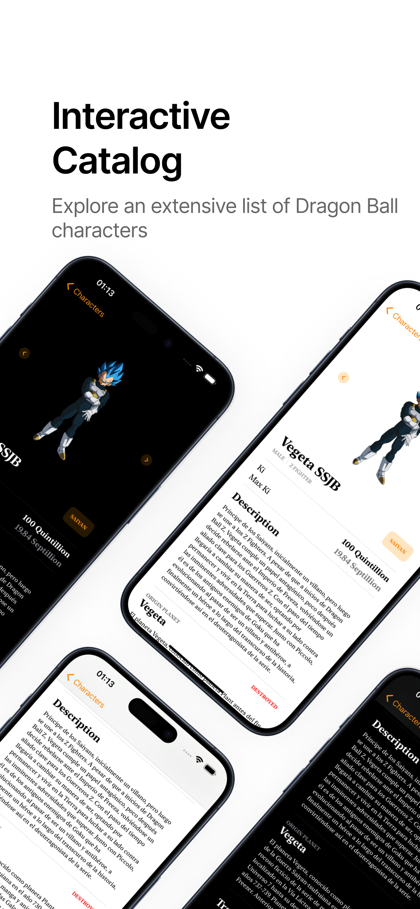
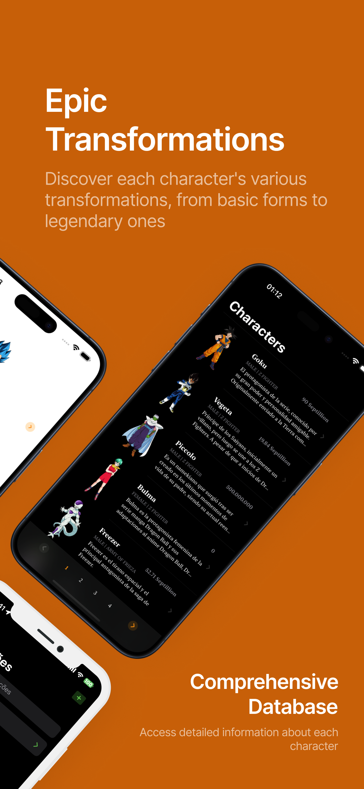

# Dragon Ball Kit

DragonBallKit is a Swift Package Manager that provides a convenient interface for consuming data from the Dragon Ball API. This package simplifies the process of integrating Dragon Ball Z-related information into your Swift projects.

  

## Features

- [X] Retrieve information about characters, and plantes from the Dragon Ball API.
- [X] Easy-to-use Swift interface for seamless integration into your iOS or macOS applications.
- [X] Comprehensive documentation for quick reference and usage.
      
## Installation

Add this project to your `Package.swift` file.

```swift
import PackageDescription

let package = Package(
    dependencies: [
        .package(url: "https://github.com/rafaelesantos/dragon-ball-kit.git", branch: "main")
    ],
    targets: [
        .target(
            name: "YourProject",
            dependencies: [
                .product(
                    name: "RefdsShared",
                    package: "dragon-ball-kit"),
            ]),
    ]
)
```
